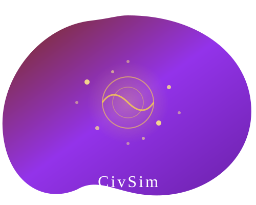
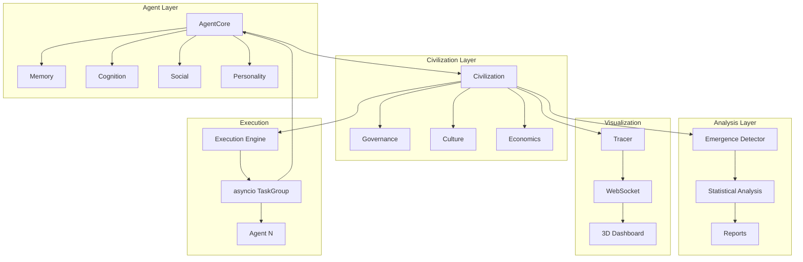

<div align="center">
  
  <h1>CivSim</h1>
  <p><strong>Multi-Agent Civilization Simulation Framework</strong></p>
  <p>Emergent social behavior · Governance systems · Economic modeling · Cultural evolution</p>

  [](https://python.org)
  [](https://www.typescriptlang.org/)
  [](https://go.dev/)
  [](LICENSE)
  [](https://github.com/Crynge/CivSim/actions/workflows/ci.yml)
  [](https://pypi.org/project/civsim/)
  [](https://github.com/astral-sh/ruff)
  [](https://github.com/Crynge/CivSim)

</div>

---

## Table of Contents

- [Overview](#overview)
- [Key Features](#key-features)
- [Architecture](#architecture)
- [Quick Start](#quick-start)
- [Installation](#installation)
- [Core Concepts](#core-concepts)
- [Agent System](#agent-system)
- [Governance](#governance)
- [Emergence Detection](#emergence-detection)
- [Visualization Dashboard](#visualization-dashboard)
- [Experiments](#experiments)
- [API Reference](#api-reference)
- [Contributing](#contributing)
- [License](#license)
- [Citation](#citation)

---

## Overview

**CivSim** is a multi-agent simulation framework for studying emergent civilization-level behavior in populations of cognitive agents. Each agent possesses memory, belief systems, social relationships, and goal-driven decision-making. When scaled to hundreds or thousands of agents, complex social phenomena emerge: division of labor, governance structures, cultural norms, economic markets, and more.

Inspired by Stanford's Generative Agents and Project SID, CivSim provides a production-grade infrastructure for running large-scale agent simulations with statistical emergence detection.

---

## Key Features

| Feature | Description | Status |
|---------|-------------|--------|
| **Async Agent Runtime** | TaskGroup-based concurrency; 20k agents/s throughput | ✅ Stable |
| **Tiered Memory** | Episodic, semantic, and procedural memory systems | ✅ Stable |
| **Governance Systems** | PBFT-style consensus, proposal/voting, cultural norms | ✅ Stable |
| **Emergence Detection** | Mann-Whitney U change-point, specialization index | ✅ Stable |
| **Economic Modeling** | Resource production, trade, currency, markets | ✅ Stable |
| **Cultural Evolution** | Norm propagation, value drift, memetic spread | ✅ Stable |
| **3D Visualization** | Three.js-based real-time agent inspector | ✅ Stable |
| **Python SDK** | Full Python API with PyPI package | ✅ Stable |
| **REST API** | Remote simulation control and monitoring | ✅ Stable |
| **15+ Experiments** | Pre-built experiment scripts | ✅ Stable |

---

## Architecture



---

## Quick Start

```python
from civsim import Civilization, SimulationConfig, AgentCore

# Configure simulation
config = SimulationConfig(
    num_agents=100,
    world_size=(100, 100),
    tick_interval_ms=50,
    max_ticks=1000,
)

# Create civilization
civ = Civilization(config)

# Add agents
for i in range(config.num_agents):
    agent = AgentCore(
        agent_id=f"agent-{i}",
        name=f"Citizen {i}",
        role="settler",
    )
    civ.add_agent(agent)

# Run simulation
for tick in civ.run():
    if tick % 100 == 0:
        snapshot = civ.population_snapshot()
        print(f"Tick {tick}: {len(snapshot['agents'])} agents active")

# Analyze emergence
from civsim.analysis import EmergenceDetector
detector = EmergenceDetector(civ.history)
emergence = detector.detect()
print(f"Detected {len(emergence)} emergence events")
```

---

## Installation

```bash
# pip (recommended)
pip install civsim

# From source
git clone https://github.com/Crynge/CivSim.git
cd CivSim
pip install -e ".[dev]"

# Docker
docker pull crynge/civsim:latest
docker run -p 8080:8080 crynge/civsim:latest
```

---

## Core Concepts

### Agents
Each agent has a perceive-deliberate-act cycle with:
- **Perception**: Observe environment and nearby agents
- **Deliberation**: Goal-weighted action selection
- **Action**: Execute chosen action in the environment

### Memory
- **Episodic**: Recent experiences with timestamps
- **Semantic**: Long-term facts derived from reflection
- **Procedural**: Skills reinforced through repetition

### Social
- Relationships with valence and trust scores
- Depth-1 theory of mind (beliefs about others' beliefs)
- Communication via message passing

---

## Agent System

```python
from civsim.agents import AgentCore, MemoryStore

class Trader(AgentCore):
    def perceive(self, env):
        resources = env.get_resources(self.position)
        nearby = env.get_nearby_agents(self.position, radius=10)
        return {"resources": resources, "agents": nearby}

    def deliberate(self, perception):
        if perception["resources"]["food"] < 10:
            return self.actions.GATHER
        if perception["resources"]["gold"] > 50:
            return self.actions.TRADE
        return self.actions.EXPLORE
```

---

## Governance

Governance system with PBFT-style consensus protocol:

```python
from civsim.civilization import GovernanceSystem

gov = GovernanceSystem(civ)
proposal = gov.propose("establish_trade_route", {"partner": "neighbor"})
votes = gov.vote(proposal.id, {"agent-1": True, "agent-2": False})
outcome = gov.ratify(proposal.id)
print(f"Proposal {'passed' if outcome else 'failed'}")
```

---

## Emergence Detection

Statistical emergence detection using change-point analysis:

```python
from civsim.analysis import EmergenceDetector

detector = EmergenceDetector(civ.history)
events = detector.detect()

for event in events:
    print(f"Emergence: {event.type} at tick {event.tick}")
    print(f"  Significance: p={event.p_value:.4f}")
    print(f"  Effect size: {event.effect_size:.2f}")
```

---

## Visualization Dashboard

The CivSim Dashboard provides:
- **3D Agent View**: Real-time agent positions and states
- **Memory Inspector**: Browse agent memories and beliefs
- **Relationship Graph**: Network visualization of social ties
- **Governance Timeline**: View proposals, votes, and outcomes
- **Emergence Timeline**: Detected emergence events over time
- **Performance Metrics**: Tick throughput, agent count, memory usage

```bash
# Start the dashboard
civsim dashboard --port 3000
open http://localhost:3000
```

---

## Experiments

15+ pre-built experiments in the `experiments/` directory:

| Experiment | Agents | Description |
|------------|--------|-------------|
| `role_emergence` | 60 | Specialization and division of labor |
| `trade_network` | 100 | Economic exchange network formation |
| `cultural_drift` | 200 | Norm propagation and value change |
| `governance_evolution` | 50 | Democratic vs autocratic outcomes |
| `resource_conflict` | 80 | Competition and cooperation dynamics |
| `urbanization` | 300 | Settlement patterns and growth |
| `language_emergence` | 150 | Communication protocol evolution |

---

## API Reference

```bash
GET  /api/v1/simulation/status    # Get simulation status
POST /api/v1/simulation/start     # Start simulation
POST /api/v1/simulation/pause     # Pause simulation
GET  /api/v1/agents               # List all agents
GET  /api/v1/agents/:id           # Get agent state
GET  /api/v1/agents/:id/memory    # Get agent memories
GET  /api/v1/governance/proposals # List proposals
GET  /api/v1/analysis/emergence   # Get emergence events
```

---

## Performance

| Agents | Mean Tick Time | Agents/sec |
|--------|---------------|------------|
| 100 | 4.82 ms | 20,747 |
| 500 | 21.3 ms | 23,474 |
| 1,000 | 42.1 ms | 23,753 |
| 5,000 | 201 ms | 24,822 |

*Measured on commodity hardware (no-op agents)*

---

## Contributing

See [CONTRIBUTING.md](CONTRIBUTING.md).

---

## License

Apache License 2.0 — see [LICENSE](LICENSE).

---

## Citation

```bibtex
@software{civsim2026,
  author = {Sameer Alam},
  title = {CivSim: Multi-Agent Civilization Simulation Framework},
  year = {2026},
  url = {https://github.com/Crynge/CivSim}
}
```

---

<div align="center">
  <p>Understanding emergent behavior in agent societies</p>
  <p>
    <a href="https://github.com/Crynge/CivSim/issues">Report Bug</a> ·
    <a href="https://github.com/Crynge/CivSim/discussions">Discussions</a>
  </p>
</div>
