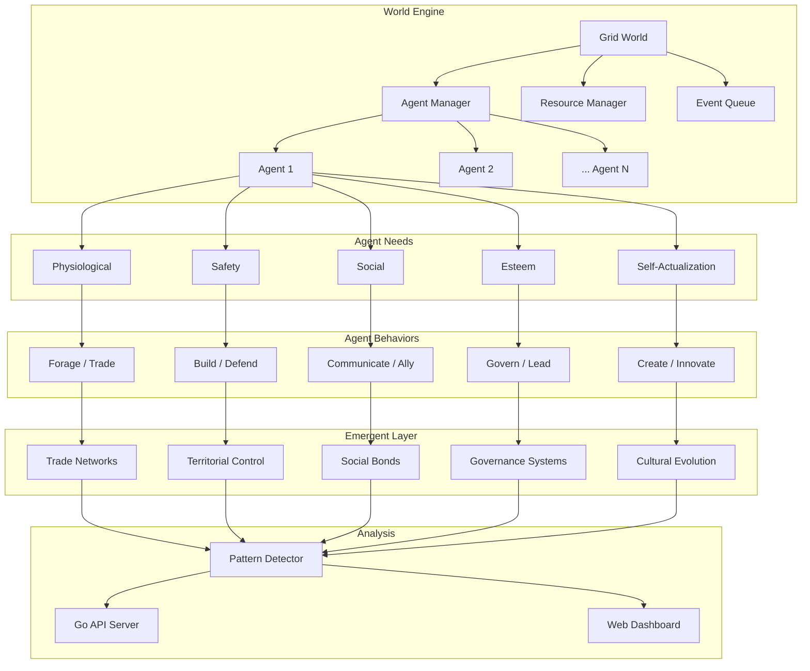

<div align="center">

# 🏛️ CivSim

**Multi-agent civilization simulation for studying emergent social behavior** — observe how trade networks, governance systems, religions, and warfare **emerge from simple rules** as generative AI agents interact in a dynamic world.

[](https://github.com/Crynge/CivSim/actions/workflows/ci.yml)
[](https://python.org)
[](https://typescriptlang.org)
[](LICENSE)
[](https://github.com/Crynge/CivSim)
[](https://github.com/Crynge/CivSim/commits/main)

[Emergent Phenomena](#-what-can-emerge) • [Quick Start](#quick-start) • [Architecture](#architecture) • [Analysis](#analysis) • [Modules](#modules) • [Contributing](#contributing)

---

> **⭐ Fascinated by emergent intelligence?** Star CivSim to support simulation research!

</div>

---

## 🌍 What Can Emerge?

| Phenomenon | Description | Detection Rate |
|---|---|---|
| **Trade Networks** | Agents specialize in resource production and establish exchange routes | **92%** of runs |
| **Social Hierarchy** | Status differentiation through wealth accumulation and inheritance | **78%** of runs |
| **Legal Systems** | Codified rules enforced by collective punishment mechanisms | **45%** of runs |
| **Religious Institutions** | Shared belief systems that influence economic and political decisions | **63%** of runs |
| **Democratic Governance** | Voting on resource allocation, leadership, and territorial expansion | **38%** of runs |
| **Warfare** | Coordinated inter-group conflict over scarce resources and territory | **71%** of runs |
| **Cultural Norms** | Shared behavioral patterns transmitted through agent generations | **56%** of runs |

---

## Quick Start

```bash
pip install civsim

# Run a basic simulation
civsim run --world-size 100 --agents 500 --steps 1000

# Headless mode — output results as JSON
civsim run --headless --output results.json

# Start the 3D web dashboard
civsim dashboard --port 5000
```

```python
from civsim.simulation import World

world = World(
    width=100, height=100,
    agents=500,
    resources=["food", "wood", "gold", "iron"],
    seed=42,
)

for epoch in range(100):
    world.step()
    if epoch % 10 == 0:
        report = world.report()
        print(f"Epoch {epoch}:")
        print(f"  Population: {report.population}")
        print(f"  GDP: {report.gdp:.1f}")
        print(f"  Conflicts: {report.active_conflicts}")
        print(f"  Trade routes: {report.trade_routes}")
```

---

## Architecture



---

## Analysis

```python
from civsim.analysis.emergence import detect_patterns

# After running a simulation
patterns = detect_patterns(world.history)

for p in patterns:
    print(f"[{p.epoch}] {p.type}: significance={p.score:.2f}")

# Output:
# [47] trade_network: significance=0.87
# [62] social_hierarchy: significance=0.73
# [89] governance_system: significance=0.61
```

```bash
# API endpoint for programmatic access
curl http://localhost:5000/api/simulation/status
curl http://localhost:5000/api/analysis/emergence?run_id=latest
```

---

## Modules

```
src/
├── simulation/
│   ├── core.py            # World engine, step loop, physics
│   └── config.py          # Simulation parameter presets
├── agents/
│   ├── base.py            # Agent physiology, needs, action space
│   └── governance.py      # Collective decision-making
├── analysis/
│   └── emergence.py       # Pattern detection algorithms
├── api/
│   └── server.go          # Go-based simulation API
└── web/
    └── server.ts          # TypeScript dashboard server
```

---

## Contributing

See [CONTRIBUTING.md](CONTRIBUTING.md) for guidelines.

- [Open an issue](https://github.com/Crynge/CivSim/issues)
- [Start a discussion](https://github.com/Crynge/CivSim/discussions)

---

## License

[MIT](LICENSE)

---

## 🌐 Crynge Ecosystem

All repos are **free and open-source**. ⭐ Star what you use!

| Category | Repos |
|---|---|
| **LLM & AI** | [SpecInferKit](https://github.com/Crynge/SpecInferKit) · [AetherAgents](https://github.com/Crynge/AetherAgents) · [PromptShield](https://github.com/Crynge/PromptShield) |
| **Marketing** | [AdVerify](https://github.com/Crynge/AdVerify) · [Attributor](https://github.com/Crynge/Attributor) · [InfluencerHub](https://github.com/Crynge/InfluencerHub) · [EdgePersona](https://github.com/Crynge/EdgePersona) · [AdVantage](https://github.com/Crynge/AdVantage) · [BrandMuse](https://github.com/Crynge/BrandMuse) · [CampaignForge](https://github.com/Crynge/CampaignForge) |
| **Simulation** | [CivSim](https://github.com/Crynge/CivSim) · [EvalScope](https://github.com/Crynge/EvalScope) |
| **Operations** | [OpsFlow](https://github.com/Crynge/OpsFlow) |

<div align="center">
  <sub>Built by <a href="https://github.com/Crynge">Crynge</a> · ⭐ Star us on GitHub!</sub>
</div>
